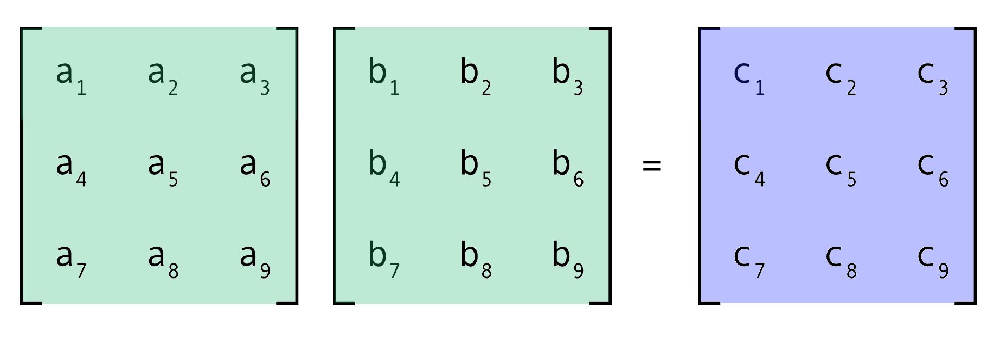
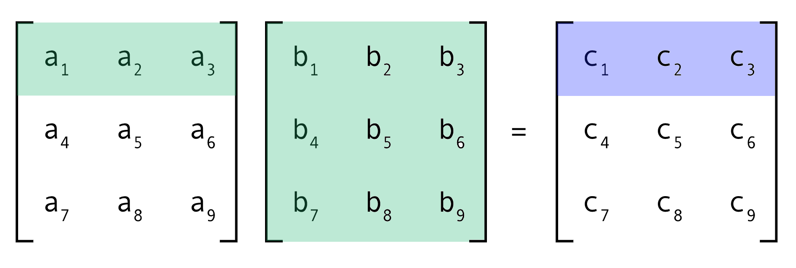

# Matrix Multiplication (Multi-Threading)


## 1. Objectives

* To get familiar with thread programming using the [Pthread library](https://hpc-tutorials.llnl.gov/posix/).
* To better understand processes and threads.

## 2. Overview

You are required to implement a multi-threaded [matrix multiplication](https://www.mathsisfun.com/algebra/matrix-multiplying.html) program.

The input to the program is two matrixes A(x*y) and B(y*z) that are read from corresponding text files. The output is a matrix C(x*z) that is written to an output text file.

A parallelized version of matrix multiplication can be done using one of these three methods:

1. A thread computes the output C matrix i.e. without multi-threading. (A thread per matrix).

2. A thread computes each row in the output C matrix. (A thread per row).

3. A thread computes each element in the output C matrix. (A thread per element).


## 3. Requirements

* Implement the multi-threaded matrix multiplication using all three methods described above.
* Compare the three implementations according to the following:
    1. Number of threads created.
    2. Execution time taken.

Your programs should do the following:

* Your program is executed as: ./matMultp Mat1 Mat2 MatOut, where Mat1 and Mat2 are the names of the text files to read the first and second matrices, respectively, and MatOut is the prefix of the text files names to write the output matrices (each file represents one method). If the user does not enter this information, the default is a.txt and b.txt, for input matrixes A and B, and c for output matrices (of all three methods) C. The following example should clarify inputs/outputs files.

    Arguments

        Example: 
            ./matMultp a b c
        Input files: 
            a.txt 
            b.txt
        Output files: 
            c_per_matrix.txt
            c_per_row.txt
            c_per_element.txt

    No Arguments:

        Example: 
            ./matMultp
        Input files: 
            a.txt 
            b.txt
        Output files: 
            c_per_matrix.txt
            c_per_row.txt
            c_per_element.txt

    Custom Arguments:

        Example: 
            ./matMultp x y z
        Input files: 
            x.txt 
            y.txt
        Output files: 
            z_per_matrix.txt
            z_per_row.txt
            z_per_element.txt

* Read the number of rows and columns of the input matrices. They are written in the first line of the file as ”row=x col=y”. The following is an example of the format on an input file.

        row=3 col=5
        1 2 3 4 5
        6 7 8 9 10
        11 12 13 14 15

* Read the input matrices from their corresponding files. Each row is on a separate line, columns are separated by spaces.
* Use threads to calculate the matrix that results from multiplying the input two matrixes.
* Output the resulting matrices in three files (each file represents one method). The following is an example of the format of the three output files.

    c_per_matrix.txt

        Method: A thread per matrix
        row=2 col=2
        1 2
        3 4

    c_per_row.txt

        Method: A thread per row
        row=2 col=2
        1 2
        3 4

    c_per_element.txt

        Method: A thread per element
        row=2 col=2
        1 2
        3 4

    Of course the values of the output matrices should all be the same for all three methods.

* **Output to the number of threads created and the time taken on the standout (the console) for all the three methods (three different outputs).**
* Assume I will not test with matrix size larger than 20 x 20.
* Your program need to handle any errors and terminate gracefully.
* You should work on this lab individually.

## 4. Synchronization

* Your program **should not** use any of the pthread synchronization functions, except for [pthread_join](https://man7.org/linux/man-pages/man3/pthread_join.3.html), i.e. you're not allowed to use mutual exclusion, or semaphores, or etc.
* You should never use [pthread_join](https://man7.org/linux/man-pages/man3/pthread_join.3.html) directly after the [pthread_create](https://man7.org/linux/man-pages/man3/pthread_create.3.html), you should use pthread_join only after the main thread has created all the worker (children) threads, otherwise your code will work in a sequential manner but just with extra overhead.
* The use of any synchronization functions, or the improper use of pthread_join, will make the submission totally unacceptable and will result into a zero grade.

## 5. Memory Management

Your code should handle memory management and sending arguments to threads functions as following:

* In the case of (A thread per row) you can do either of the following:
  * Leave matrices A, B, and C in the global segment and only pass the row number to the thread function by value.
  * Create A, B, and C in the dynamic heap, then create a struct that has A*, B*, C* (pointers to the arrays) and the row number, then send the struct to the thread function by reference (allocate the struct in the dynamic heap).
* In the case of (A thread per element) you can do either of the following:
  * Leave matrices A, B, and C in the global segment, then create a struct that has the row number, and the column number, send this struct to the thread function by reference (allocate the struct in the dynamic heap).
  * Create A, B, and C in the dynamic heap, then create a struct that has A*, B*, C* (pointers to the arrays), the row number, and the column number , then send the struct to the thread function by reference (allocate the struct in the dynamic heap).
* In all cases, you have to free any allocated memory in the dynamic heap at the end of the worker (child) thread, no memory leak should be allowed.

## 6. Deliverables

* Complete source code in C, commented thoroughly and clearly.
* A make file that we can use to compile/build your code. Note that you need to call the executable matMultp.
* A report that describes the following:
    1. How your code is organized.
    2. Your code main functions.
    3. How to compile and run your code.
    4. Sample runs.
    5. A comparison between the three methods of matrix multiplication.
* A 2-min (tolerance of 30 seconds only) video that shows the output of those test cases ([test1](test1/), [test2](test2/) & [test3](test3/)).

## 7. Hints

To measure the execution time, you will need to use code that is similar to this:

```C
#include <sys/time.h>

main()
{
    struct timeval stop, start;

    gettimeofday(&start, NULL); //start checking time
    //your code goes here
    gettimeofday(&stop, NULL); //end checking time

    printf("Seconds taken %lu\n", stop.tv_sec - start.tv_sec);
    printf("Microseconds taken: %lu\n", stop.tv_usec - start.tv_usec);
}
```

## 8. Frequently Asked Questions

1. Why the first method (a thread per matrix) is performing better than the second (a thread per row) and the third (a thread per element)?

    The idea is, creating and handling threads requires extra overhead and lots of computation, so, it's not always the ideal solution to go for multi-threading, and there's always a tradeoff.

    In the case of matrix multiplication, it's better programmed in [many-core programming (using GPUs)](https://www.quantstart.com/articles/Matrix-Matrix-Multiplication-on-the-GPU-with-Nvidia-CUDA/) or in case of CPU multi-threading, it would make sense to use per row in very large matrices, or actually, we could use threads for regions or blocks as in [block matrix multiplication](https://www.tutorialspoint.com/parallel_algorithm/matrix_multiplication.htm).

    In designing multi-threaded programs, you always consider many things, including the threading overhead, the size of the problem, and the level of concurrency. There's no rule for that, you just make your own analysis and take your decision accordingly.

## Readings & Resources

* [Stack vs Heap Memory.](https://dotnettutorials.net/lesson/stack-vs-heap-memory/)
* [C Dynamic Memory Allocation.](https://www.programiz.com/c-programming/c-dynamic-memory-allocation)