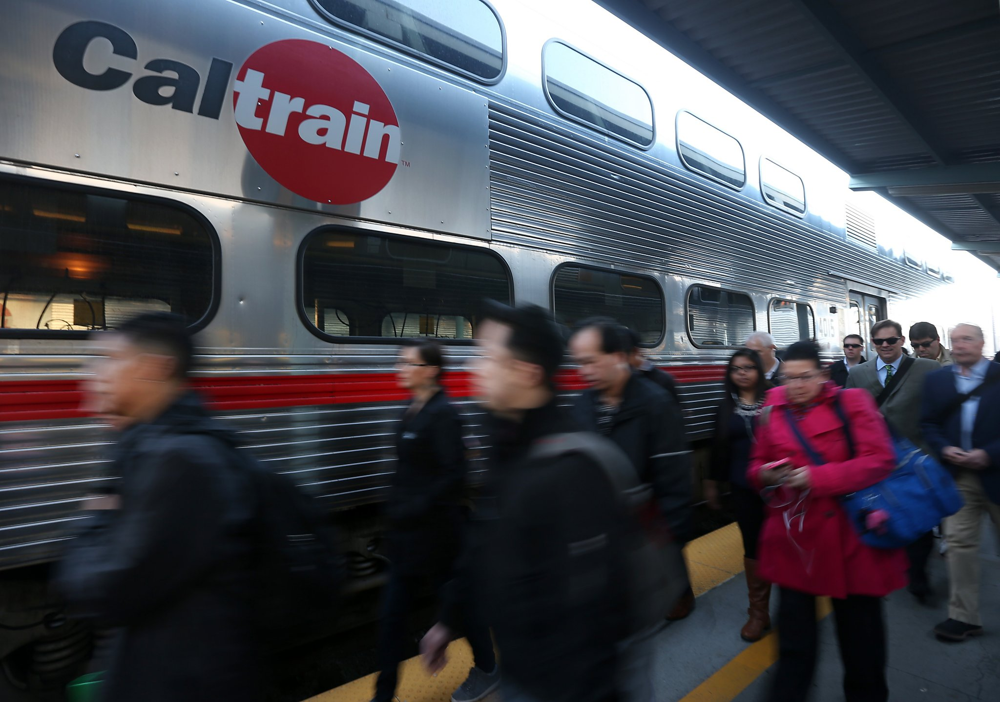

# CalTrain (Synchronization and Mutual Exclusion)

## 1. Objectives

* To get familiar with concurrent programming.
* To better understand handling races, synchronization, mutex, and condition variables.
* To learn about debugging concurrent programs.

## 2. Problem Statement

CalTrain (the train running in California, USA) has decided to improve its efficiency by automating not just its trains but also its passengers. From now on, passengers will be robots. Each robot and each train is controlled by a thread. You have been hired to write synchronization functions that will guarantee orderly loading of trains. You must define a structure struct station, plus several functions described below.

1. When a train arrives in the station and has opened its doors, it invokes the function: **station_load_train(struct station * station, int count)** where count indicates how many seats are available on the train. The function must not return until the train is satisfactorily loaded (all passengers are in their seats, and either the train is full or all waiting passengers have boarded). Note, that the train must leave the station promptly if no passengers are waiting at the station or it has no available free seats.

2. When a passenger robot arrives in a station, it first invokes the function: **station_wait_for_train(struct station * station)** This function must not return until a train is in the station (i.e., a call to station load train is in progress) and there are enough free seats on the train for this passenger to sit down. Once this function returns, the passenger robot will move the passenger on board the train and into a seat (you do not need to worry about how this mechanism works).

3. Once the passenger is seated, it will call the function: **station_on_board(struct station * station)** to let the train know that it’s on board.

## 3. Requirements

1. Write the declaration for **struct station** in the file [caltrain.h](lab3_starter_code/caltrain.h).
2. Write the three required functions (described above) and the function **station_init**, which will be invoked to initialize the station object when CalTrain boots in the file [caltrain.c](lab3_starter_code/caltrain.c).
3. You must write your solution in C using Pthreads mutex and condition variables. Note, you should **not** use semaphores or other synchronization primitives.
4. You may not use more than a **single lock** in each struct station.
5. **Don’t use any global variables**. Just fill the required functions and the station struct.
6. You may assume that there is never more than one train in the station at once, and that all trains (and all passengers) are going to the same destination (i.e. any passenger can board any train).
7. Your code must allow multiple passengers to board simultaneously. Use **pthread_cond_broadcast** for signaling all passengers to board the train, but signaling the train to leave can be done using **pthread_cond_signal**.
8. Your code must **never** result in busy-waiting.
9. Minimize all critical sections, don’t just put all your code inside a mutex lock. We will check every single statement in your code and see whether it needed to be put inside a lock or not.

## 4. Notes

* You need to work on this project individually.
* Your laptop should be using Ubuntu either installed or on top of Virtual Machine (VM).
* If you’re using VM, make sure you’ve allocated more than 1 core for the VM.
* You can find the the starter code [here](lab3_starter_code/).
* Never modify [caltrain-runner.c](lab3_starter_code/caltrain-runner.c).
* You will submit only the filled copies of caltrain.c & caltrain.h files. I will not consider any other files. I will use the original copy of caltrain-runner.c for testing.
* If the tester reports success, it doesn’t mean your implementation is correct. Might be the case that the scheduler selected the threads in order that doesn’t show you any error. In order to make sure that the implementation is correct, run the project several times and make sure it doesn’t fail once.
* You could use [this script](lab3_starter_code/repeat.sh) to run your code many times and make sure it doesn't fail any times in the produced output.
* This assignment is based on assignment0 offered at Stanford CS140 Operating Systems.
* There’s no report required.
* Implementation hints: For more information on how to use locks, condition variables and monitors in C, please check the following [link](https://web.stanford.edu/~ouster/cgi-bin/cs140-spring20/lecture.php?topic=locks#:~:text=Condition%20variables%3A%20used%20to%20wait,re%2Dacquire%20lock%20before%20returning.)
